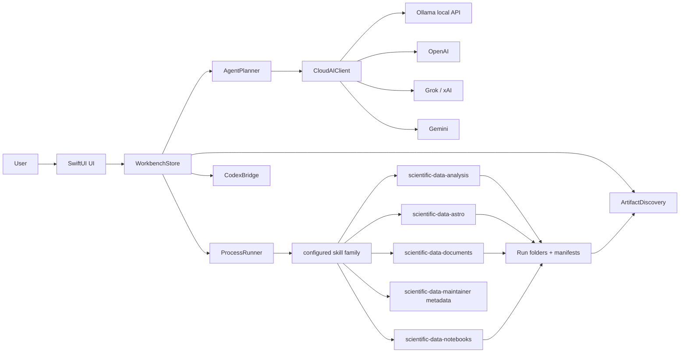

# Scientific Workbench Architecture

Scientific Workbench is a native macOS app for AI-assisted scientific workflows. Its job is to combine a conversational interface with deterministic local capabilities from a configured five-skill family. This source checkout includes a reviewed copy under `skills/`.

## Product Shape

The user should be able to:

1. Use local AI by default or connect one or more optional cloud AI providers.
2. Attach files or folders.
3. Ask in natural language.
4. Review a proposed workflow.
5. Execute local capabilities safely.
6. Inspect results, logs, and artifacts.
7. Export or continue work without modifying original inputs.

## High-Level Architecture

## Configured Skill Family

Scientific Workbench loads the modular skill family from the mother root chosen
in Settings. For this source distribution, the reviewed five-root snapshot is
already in the repository's `skills/` directory; the installation guide points
Settings to `skills/scientific-data-analysis` in the checkout. The app runs those
roots in place and does not copy them into the `.app` bundle or overwrite any
separately installed skill family. The release manifest's `skill_release` is a
declared compatibility axis; the exact configured content is bound
independently by the resolved registry chain and its SHA-256 evidence. Registry
stubs can retain different historical release labels and are not presented as
one independently observed family version.

`SkillRootCatalog` derives five sibling roots from the configured mother root:

- `scientific-data-analysis`
- `scientific-data-astro`
- `scientific-data-documents`
- `scientific-data-notebooks`
- `scientific-data-maintainer`

`CapabilityRegistryLoader` resolves `public_surface_registry.yaml` recursively:
it opens the registry stub, follows relative `canonical_registry` hops until an
`entries:` registry is found, records the resolved path/fingerprint, and then
associates each `CapabilityEntry` with the installed root that actually owns its
script. `CapabilityCommandBuilder` executes each capability from that owning
root as `workingDirectory`; the user-facing Settings field remains the mother
skill root because the child roots are discovered next to it.

Registry loading is fail-closed for contract drift. Duplicate capability IDs are
accepted only when their metadata and resolved-registry fingerprint agree;
divergent metadata, incompatible snapshots, duplicate root roles, missing
required contract fields, unsupported enum/boolean values, canonical hops into
unrelated sibling skills, missing expected-owner scripts, and ambiguous
execution ownership are errors. A genuinely
absent optional module is different from a broken installed module: the mother
catalog remains usable and the app surfaces a degraded-catalog notice, while a
configured child with an invalid registry still fails loading.

Maintainer metadata may be read for registry and regression compatibility, but
maintainer-only routes are not exposed as normal user actions. If a maintainer
script lacks a standalone `datanalysis_env.py` wrapper, execution falls back to
the mother root wrapper while keeping the route outside the normal capability
surface.

External skill processes still use a restricted environment. The app adds only a
trusted, app-computed `PYTHONPATH` for the selected skill root's `scripts` and
`fixtures` directories so thin Python entrypoints can import sibling modules
without inheriting the user's `PYTHONPATH` or secrets.

## Modules

### App

Files:
- `Sources/<SwiftPM target>/App/<main entrypoint>.swift`
- `Sources/<SwiftPM target>/App/<app scene>.swift`

Responsibilities:
- Launch GUI mode.
- Launch headless automation mode for end-to-end tests.
- Activate the app as a regular macOS app.
- Start registry and environment refresh.

Headless mode exists so the app can be tested as a real product without relying on manual clicking.
`script/run_smoke_matrix.sh` uses this mode to run deterministic planner smoke tests against temporary non-DOCUS fixtures.
`script/run_golden_transcript_gate.sh` launches isolated headless planner sessions and compares sanitized transcripts against reviewed golden snapshots, including DOCUS-like report-plan ordering and raw capability arguments.
`script/run_e2e_capability_matrix.sh` uses the same mode with auto-run enabled to execute guided capabilities and validate the resulting transcripts, summaries, manifests, artifact indexes, workflow-summary Markdown contracts, and unchanged input fingerprints.
`script/run_mixed_research_benchmark.sh` creates a generated non-DOCUS folder with FITS, CSV, Markdown notes, and a tiny PDF, then verifies folder-level routing through FITS, table, document, and cross-domain capabilities.
`script/run_docus_benchmark.sh` is an optional realistic benchmark for `$HOME/Desktop/DOCUS`: it records lexical SHA-256/`lstat` fingerprints plus an `mtree` metadata, ACL, and xattr baseline; rejects reused or source-overlapping output roots before writing; copies DOCUS into a benchmark workspace; removes and records external symlinks only in that copy; and verifies the original even when the app exits early. It runs the app only against the copy, validates the exact PDF/HTML document-intake set and the 16-step DOCUS report plan, records first-blocker progress with `DOCUS_BENCHMARK_MODE=progress`, and requires an indexed PDF only with `DOCUS_BENCHMARK_MODE=full`. Full/progress mode uses an ASCII-safe benchmark root without whitespace because legacy IRAF/CL tools can fail when their working tree contains spaces. The post-fix M101 standalone and quality-gate proofs each completed 16/16 jobs, ingested 4/4 expected documents including the literal `A\&A` filename, indexed a PDF, produced identical original fingerprints, and left an empty `mtree` difference.
`script/run_secret_redaction_gate.sh` launches headless automation with fake provider credentials and scans generated outputs for secret leaks.
`script/run_first_run_smoke.sh` launches the packaged app with isolated preferences and verifies that a fresh first-run transcript includes setup checklist/recovery state, plans locally, and leaves input fixtures unchanged.
`script/run_finder_dock_smoke.sh` opens the staged app bundle through LaunchServices and verifies foreground activation, bundle id, Dock visibility metadata, and a running Dock tile.
`script/check_settings_surface.sh` statically protects the release-facing Settings surface for setup paths, local AI, optional cloud credentials, connection tests, support/configuration actions, and stale advanced-control regressions.
`script/run_packaged_real_run_smoke.sh` opens the packaged app with auto-run enabled and verifies a real CSV workflow completes with jobs, artifacts, manifests, a workflow summary, and unchanged inputs.
`script/run_quality_gate.sh` is the top-level local gate. It runs source hygiene,
Swift tests, process-group smoke, planner and golden-transcript gates, capability
E2E, mixed benchmark, secret/settings/readiness checks, first-run smoke, bundle
verification, Finder/Dock, packaged real-run, and UI smoke. It includes DOCUS
only when `RUN_DOCUS_BENCHMARK=1` is set.
All of this is smoke/regression coverage: it is strong release evidence, not a claim of exhaustive coverage over every optional backend, legacy environment, or GUI edge case.
`script/verify_app_bundle.sh` verifies the staged `.app` bundle metadata, icon, executable, bundled user guide, and a packaged headless planning launch.
`script/package_release.sh` builds a release SwiftPM app bundle, verifies it,
creates a zip artifact and manifest, and optionally signs/notarizes with a
Developer ID identity and stored `notarytool` profile.
New packages use a build-specific schema-2 manifest and require a clean Git
worktree. The manifest records the app, integrated-release, and declared skill
version axes; full and short source revision; branch; host/toolchain metadata;
validation flags; the mother-registry stub SHA-256; every resolved
`canonical_registry` hop with relative path and SHA-256; and the final canonical
registry path/digest. Packaging rechecks a clean, unchanged Git `HEAD` after
validation and before manifest creation, and verifies that the installed
registry chain did not change during the build. Existing archives/manifests are
never rewritten, and packaging refuses to overwrite an archive or manifest with
the same build identity. ADR 0003 defines this evidence contract; implementing
the contract does not itself prove that a release gate ran or that a package was
produced.
For final base-pathway milestones, run it with `--run-quality` and
`RUN_DOCUS_BENCHMARK=1 DOCUS_BENCHMARK_MODE=full` so the manifest records that
the complete gate ran during packaging.
`script/verify_release_archive.sh` re-validates release packages by checking
the manifest, extracting the zip, and running packaged bundle verification
against the extracted `.app`.
`script/check_release_readiness.sh` statically verifies release docs, package
script wiring, and avoids legacy notarization commands.

Support bundles are exported under `<output root>/.scientificworkbench/support/`.
They include `support_bundle.md`, redacted `state.json`, and a redacted copy of
the latest workflow summary when available. Setup recovery state is included
when first-run requirements are blocked, so failed setup and failed runs can be
inspected without relying on screenshots.
Configuration exports are written as non-secret JSON under
`<output root>/.scientificworkbench/configuration/` by default. The export records
local paths for review, but import applies only portable provider/model choices,
the Ollama endpoint, attachment context, and process timeout. Machine-local
paths, executables, output authority, the Codex sandbox, and API keys remain
unchanged.

### Views

Files:
- `AgentView.swift`
- `SidebarView.swift`
- `SettingsView.swift`
- `SetupChecklistView.swift`
- `ContentView.swift`
- `HomeView.swift`
- `JobsView.swift`
- `ResultsView.swift`
- `CapabilityCatalogView.swift`

Responsibilities:
- Present the app as a macOS-native workbench.
- Keep Settings visible inside the app, not hidden only in the macOS menu.
- Let the user choose provider, mode, inputs, auto-run, and artifacts.
- Keep local AI setup, optional cloud credentials, connection tests, support bundles, and configuration import/export visible in Settings.
- Guide first use with a setup checklist in Chat, Dashboard, and Settings without turning the first screen into a marketing page.
- Surface setup recovery actions directly inside the checklist when required items are blocked.
- Include setup checklist and recovery state in headless launch transcripts so first-run automation can be verified without screenshots.
- Never make long operations look frozen.

Rule:
- UI should call store methods, not directly run processes or call AI providers.

### Store

File:
- `Sources/<SwiftPM target>/Stores/WorkbenchStore.swift`

Responsibilities:
- Own app state.
- Load capability registry.
- Refresh environment status.
- Derive setup recovery state from required checklist blockers.
- Manage inputs.
- Plan workflows.
- Run workflows.
- Persist settings.
- Save secrets through `SecretsStore`.
- Write launch transcripts.
  - Headless test launches can use `--agent-isolated-session` so transcripts are not polluted by the user's saved jobs, settings, or active UI state.

`WorkbenchStore` remains the `MainActor` orchestration center, while execution,
dry-run, routing, summaries, staging, filesystem/network policies, and provider
connection evaluation are delegated to focused services. `AIConnectionService`
owns connection preflight, provider failure mapping, recovery guidance, and secret
redaction; the store publishes only the current session result. Further workflow
and persistence decomposition remains future work.

### Models

Files:
- `AgentModels.swift`
- `CapabilityEntry.swift`
- `LaunchAutomationOptions.swift`
- `RunModels.swift`

Responsibilities:
- Represent app sections, run requests, jobs, artifacts, environment status, agent modes, AI providers, plans, and steps.

Important model concepts:
- `AIProvider`: Ollama, OpenAI, Grok/xAI, Gemini.
- `AgentRunMode`: Auto, Chat, Workflow, Codex.
- `AgentPlan`: a proposed workflow.
- `AgentPlanStep`: one capability execution or planned action.
- `AgentPlanStepExecution`: in-memory execution state for one workflow step, used to resume a plan from the last successful step.
- `AgentPlanEstimate`: conservative local estimate for enabled plan runtime, cloud-planning cost notes, and long-workflow cautions.
- `JobRecord`: one local execution result, including original request inputs/raw arguments, retry provenance, and recovery advice for failed or blocked runs.

### AI Providers And Connections

File:
- `Sources/<SwiftPM target>/Services/CloudAIClient.swift`

Responsibilities:
- Provide one app-facing API for local and cloud AI text generation.
- Use an injectable HTTP loader so provider calls can be tested without internet, user keys, local model downloads, or token spend.
- Support:
  - Ollama local `/api/chat`.
  - OpenAI Responses API.
  - Grok/xAI Chat Completions-compatible API.
  - Gemini `generateContent`.
- Test provider connectivity with a short known response.
- Build attachment previews.
- Return plain text to chat and planner.
- Classify provider failures into user-actionable states: invalid key, quota/rate limit, model unavailable, network issue, timeout, service unavailable, or malformed response.

Security rules:
- Never log raw provider credentials.
- Keep provider request failures user-readable.
- Redact known credentials before showing errors or writing transcripts.
- Before the first OpenAI, Grok/xAI, or Gemini request containing a prompt or
  local context, present a native just-in-time consent sheet with the exact
  provider, model, purpose, privacy mode, and data categories. Approval is held
  only in memory for that provider/category set; adding a category requires a
  new review, and cancellation sends nothing and preserves the draft.
- Apply `CloudAttachmentContextMode` to workflow-recovery context as well as
  attachments. `none` sends status/count metadata without local names, paths,
  previews, or logs; `filenamesOnly` sends basenames and recovery metadata but
  no content or absolute paths; `previews` permits bounded previews/excerpts
  after absolute local paths are withheld. `CloudAIClient` re-applies the
  recovery filter at the final payload boundary.
- Keep Ollama and deterministic local planning outside the cloud-consent flow.
- Use an ephemeral URL session that rejects HTTP redirects. Validate Ollama
  endpoints before attachment previews are read and accept only HTTP(S)
  loopback hosts (`localhost`, `127.0.0.0/8`, or `::1`).
- Recompute the exact provider/model/prompt/history/input/recovery/catalog
  fingerprint at confirmation time. Changed data is not sent and requires a new
  review; approval defaults to one request with optional category-scoped session
  reuse.
- Do not claim file modifications unless a local tool actually made them.

Authentication policy:
- Use official provider authentication only.
- Ollama uses the local HTTP API at `http://localhost:11434` by default and does not require an API key.
- OpenAI and xAI/Grok currently use API keys for model API access.
- Gemini currently uses an API key. OAuth is deferred until the project owns an
  OAuth client and implements redirect, token refresh/revocation, Keychain,
  privacy, and integration-test requirements; the app does not store OAuth
  tokens today.
- Do not automate consumer web sessions or copy browser cookies.

Local model policy:
- The default Ollama model is `qwen3:4b-instruct`.
- This was chosen for the current target laptop profile: Apple M1 Pro, 16 GB RAM, arm64, roughly 85 GiB free disk at the time of selection.
- It is still a small local download for this machine while improving planning, Spanish, long-context handling, and code-like reasoning over the earlier tiny fallback.
- Heavier models such as Qwen3 8B/14B or larger variants are opt-in upgrades, not defaults.
- Settings exposes local model profiles so the user can choose compact (`qwen3:1.7b`), balanced (`qwen3:4b-instruct`), or stronger (`qwen3:8b`) without memorizing Ollama model tags. Custom tags remain possible through the exact model field.

### Planner

File:
- `Sources/<SwiftPM target>/Services/AgentPlanner.swift`

Responsibilities:
- Produce `AgentPlan`.
- Use selected AI provider when configured or local/no-key provider when selected.
- Fall back to deterministic local planning when AI planning fails or a keyed provider has no key.
- Include specialized routing for known workflows such as DOCUS/UCM spectroscopy.
- Include structured workflow recovery context in chat prompts so local AI can explain exactly where a run stopped, what job/logs to inspect, and whether to dry-run, retry, or run remaining steps.

Planning principle:
- AI can choose and explain.
- Local capabilities execute.
- Recovery explanations are grounded in app-owned job/step state, not in model memory or guesses.
- The user should be able to review before execution unless auto-run is enabled.
- DOCUS is used as a realistic benchmark/regression case, but planner quality must be tested with smaller non-DOCUS fixtures too.
- Folder routing should inspect a bounded set of contained file extensions so generic folders with FITS, tables, or documents do not depend entirely on prompt wording.
- Guided table execution should choose a table file inside an attached folder before falling back to the folder itself.
- Editable plans should show conservative runtime/cost estimates before execution; estimates are guidance, not guarantees.
- Reviewed plans can be exported as redacted JSON under `<output root>/.scientificworkbench/plans/`; this is the foundation for future import/rerun support.
- Exported plans can be imported back into the editable plan card. Import never auto-runs; it restores only input paths that still exist and disables steps whose capabilities are missing from the current registry.
- Support bundles can be exported from Settings, the Workbench menu, or recovery UI. They snapshot plan, job, setup, provider, recovery, recent-message, and summary state with configured API secrets redacted.
- Configuration export/import is intentionally non-secret: API keys stay in Keychain or the environment and are excluded from portable configuration files. Import also preserves machine-local paths, executables, output authority, and the Codex sandbox instead of treating them as portable settings.
- Editable plans support dry-run validation. Dry-run builds each command and resolves placeholders without executing processes or creating output folders.
- Fragile legacy IRAF/fxcor and LaTeX execution uses the dedicated
  `~/Documents/ScientificWorkbenchRuns/LegacyWorkspaces` root when the preferred
  path contains spaces, non-ASCII characters, or exceeds the empirically safe
  legacy path-length limit. The selected run directory remains recorded in the
  job and transcript.

### Runner

Files:
- `ProcessRunner.swift`
- `ProcessGroupProcess.swift`
- `CapabilityCommandBuilder.swift`
- `FilesystemSafetyPolicy.swift`
- `RunDirectoryFactory.swift`
- `ToolEnvelopeParser.swift`
- `ArtifactDiscovery.swift`

Responsibilities:
- Convert a capability and run request into a process command.
- Execute safely.
- Track active processes so long local runs can be cancelled from the UI.
- Capture stdout/stderr/exit code.
- Run each external command in its own POSIX process group. Cancellation and
  timeout keep monitoring and signal descendants that remain in that owned
  group, including after the original parent exits.
- Route capability execution, the Codex bridge, and `ollama pull` through the
  same restricted-environment/timeout/cancellation machinery.
- Parse standard JSON envelopes.
- Discover artifacts.
- Retry completed jobs with the same stored request while preserving `retryOfJobID` provenance.

Safety rules:
- Inputs are read-only by convention.
- Outputs go to run directories under the configured output root.
- Reject filesystem root, the home directory, protected system/credential
  locations, output/input overlap, and run folders outside the approved runs
  root. Writing directly to Desktop/Documents/Downloads requires an explicit
  Settings confirmation rather than an implicit write.
- Canonicalize output roots, run directories, and raw paths after resolving
  symlinks. Output paths must remain inside the current run; explicit raw read
  paths must be attached inputs or recorded derived runs. Reject unknown options
  that look path-bearing, overwrite/force and network/API overrides, arbitrary
  SQL, and inline notebook mutation.
- Launch transcripts must be new, non-overwriting files directly inside the
  approved output root. Legacy report population copies a symlink-free project
  into the current run and never edits the source project.
- Add a UUID-derived suffix to each sanitized run-directory name so concurrent
  or same-second runs do not collide.
- Raw arguments should be minimized and replaced by guided capability builders where possible.
- Cancelled runs are represented as `JobStatus.cancelled`, preserving the run folder and logs collected so far.
- Structured `BLOCKED` states remain blocked and `FAIL`, `FAILED`, `ERROR`, or
  `ROTO` remain failed even if the child process exits with code 0.
- stdout/stderr are written to temporary files while the process runs. Each
  stream has a 256 MiB temporary-output limit; after completion, at most 4 MiB
  per stream is retained through head/tail sampling with an explicit omission
  marker. `ProcessResult` records total byte counts and truncation flags.

### Codex Bridge

File:
- `CodexBridge.swift`

Responsibilities:
- Run Codex CLI non-interactively from the output root.
- Pass attached paths as read-only context unless explicitly requested.
- Use the shared restricted process environment, `/dev/null` stdin, timeout,
  task cancellation, and owned process-tree termination.

Codex is best for:
- coding tasks
- report drafting from already-generated artifacts
- local reasoning with filesystem context

Codex is not the main deterministic workflow executor.

### Secrets

File:
- `SecretsStore.swift`
- `SecretsRedactor.swift`

Responsibilities:
- Store provider API keys in Keychain.
- Read keys from Keychain.
- Allow environment variable fallback in `WorkbenchStore`.
- Redact configured secrets from user-visible errors, job records, and launch transcripts.

Provider environment variables:
- `OPENAI_API_KEY`
- `XAI_API_KEY`
- `GEMINI_API_KEY`
- `GOOGLE_API_KEY`

Connection evidence policy:
- Keep provider connection status in memory only. A relaunch, credential edit,
  model edit, or endpoint edit resets the status to `unknown`; a previous probe
  must not be presented as evidence for changed conditions.
- Revisit official Gemini OAuth only after its client-registration, redirect,
  token-lifecycle, Keychain, consent, privacy, and test prerequisites exist.

Required future work:
- Expand malformed-response tests if provider-specific edge cases appear beyond the current shared invalid-response handling.

### Local AI Setup

File:
- `Sources/<SwiftPM target>/Services/OllamaSetupService.swift`

Responsibilities:
- Detect whether the `ollama` CLI is available.
- Check the local Ollama API for installed models through `/api/tags`.
- Pull the selected local model through `ollama pull` when the user chooses it.
- Keep setup inside Settings so the user does not have to use Terminal for normal preparation.

Rules:
- Do not install software automatically.
- Opening the official download page is allowed.
- Downloading a model requires an explicit button press.
- If Ollama is missing or closed, fail fast with a user-readable state.
- `ollama pull` uses the shared restricted runner with `/dev/null` stdin, a
  dedicated pull timeout, cancellation, and process-tree termination.

## Workflow Lifecycle

1. User attaches files/folders.
2. User writes prompt.
3. `WorkbenchStore.submitAgentChatPrompt()` routes:
   - Chat
   - Workflow
   - Codex
   - Auto
4. If routing would send prompt/local context to a configured cloud provider,
   the store pauses before network I/O and requests just-in-time consent for the
   computed data categories. Ollama/local routing continues without that sheet.
5. Workflow mode calls `AgentPlanner.plan()`.
6. Planner returns `AgentPlan`.
7. If auto-run is enabled, `WorkbenchStore.runAgentPlan()` executes steps.
8. Each step creates a collision-resistant run directory and validates it
   against the output/input containment policy.
9. `CapabilityCommandBuilder` builds and validates the command.
10. `ProcessRunner` executes.
11. `ToolEnvelopeParser` reads structured status, warnings, errors, app hints, and next actions.
12. `JobRunBundleService` consumes summary/manifest metadata, writes redacted command/stdout/stderr sidecars, and `ArtifactDiscovery` indexes typed outputs.
13. `WorkbenchStore` writes a workflow summary Markdown file with read-only inputs, job statuses, indexed artifacts, PDF deliverables, and the safety note.
14. `WorkbenchStore` persists schema-2 job history under `<output root>/.scientificworkbench/jobs.json` so completed jobs survive app relaunches.
15. `WorkbenchStore` records per-step workflow execution state so a user can edit or disable a failed step and run the remaining steps from the last successful checkpoint.
16. `WorkbenchStore` persists the schema-2 active plan and workflow checkpoints under `<output root>/.scientificworkbench/agent_state.json`.
17. UI shows jobs/results, per-step plan status, `Run Remaining`, and the latest workflow summary from Chat.
18. Headless automation can write structured launch transcripts including the planned workflow, raw step arguments, estimate, messages, and jobs.

## Data And Artifact Policy

Inputs:
- Must be treated as read-only by default.
- Should not be copied unless a capability explicitly prepares a safe workspace.

Outputs:
- Must be written under `outputRootPath`.
- Each job has its own run directory.
- Job history is persisted under `<output root>/.scientificworkbench/jobs.json` and can be reloaded, revealed, or cleared from Jobs.
- Schema-1 job/agent state is migrated explicitly. Before any migration or
  recovery rewrite, the exact original is copied to
  `<output root>/.scientificworkbench/recovery/` and retained.
- Partially corrupt job arrays are decoded record by record. Duplicate persisted
  identifiers are resolved before SwiftUI lists or execution dictionaries see
  them. Unknown future schemas and symbolic-link state files remain untouched.
- Each run should contain:
  - `summary.json`
  - `manifest.json`
  - `stdout.txt`, `stderr.txt`, and `command.txt`
  - `next_steps.md`
  - stdout/stderr in `JobRecord`
  - typed artifacts and app-facing envelope metadata in persisted job history
- Interrupted jobs are normalized to Cancelled on relaunch and their run folders are re-indexed.
- Image, first-page PDF, CSV/TSV, Markdown, JSON, notebook, and log previews are bounded before display.
- Per-job support bundles copy only redacted safe text sidecars; heavy or personal artifacts remain in the run folder.
  - artifacts
- Failed, blocked, and cancelled jobs expose recovery advice in the Jobs detail pane before retry.

Cloud AI:
- Receives only the categories disclosed by the just-in-time consent flow and
  permitted by the selected attachment/recovery privacy mode.
- Large folders should be summarized by local tools first, then summarized by AI.
- The user sees what categories will leave the Mac before the first applicable
  request and again if a later request expands that set.

Local AI:
- Remote and non-HTTP(S) Ollama endpoints are rejected before network or local
  preview access; accepted endpoints are restricted to loopback hosts.
- The app should still avoid sending huge recursive folder previews directly to local AI; local capability summaries are more reliable and faster.

## Current Known Risks

- Sidebar navigation has a packaged accessibility-tree smoke for all seven
  destinations; a manual VoiceOver/usability session is still required before
  M104 closure.
- Real cloud provider connection tests require user credentials and may consume quota.
- Real Ollama connection tests require Ollama installed, the server running, and the selected model pulled.
- Guided catalog column inspection currently supports CSV, TSV, ECSV and
  delimited text. Binary table formats supported by the backend still require
  conversion to a reviewed text table or the expert CLI.
- Cloud report drafting can stall if too much context is attached.
- Process-group termination is not an OS sandbox: a descendant that creates a
  new session/process group can escape the owned group.
- An explicitly attached code file can run in a notebook copy after
  confirmation; this does not provide OS-level code sandboxing.
- M101 passed the complete release/readiness, dual app + skill, and copied-input
  DOCUS gates. No M101 package was created; packaging still requires a clean
  committed revision, a new build identifier, and explicit authorization.
- Recovery archives can contain local paths and redacted or unredacted historical
  logs from an older app state. They remain private local evidence and need a
  deliberate retention/export policy before any support-sharing feature includes
  them.

## Research Backlog

Research should produce implementation decisions in `DECISIONS/`.

Topics:
- Apple Human Interface Guidelines for macOS.
- SwiftUI/AppKit split for robust macOS apps.
- Human-AI interaction guidelines.
- Multi-tool LLM orchestration.
- Safe tool use for local agents.
- Scientific workflow reproducibility.
- macOS signing, notarization, and packaging.

## Definition Of Done

A feature is not done until:

- It is reachable in the UI.
- It has a clear success state.
- It has a clear failure state.
- It does not leak secrets.
- It does not modify original inputs unless explicitly approved.
- It is covered by unit, integration, or end-to-end verification appropriate to its risk.
- Its tests do not rely only on DOCUS unless the feature is specifically DOCUS/UCM-specialized.
- It is documented if it changes architecture or user workflow.
